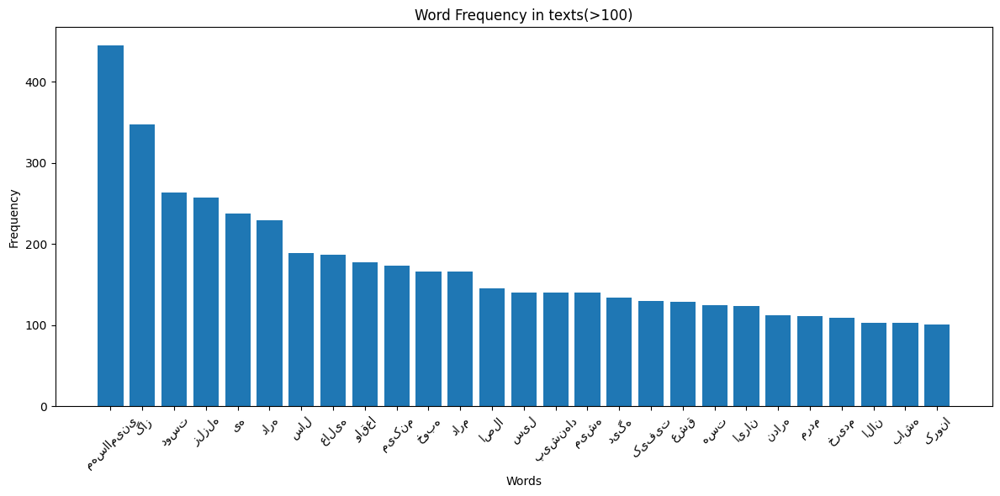
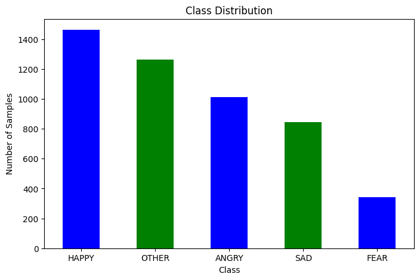
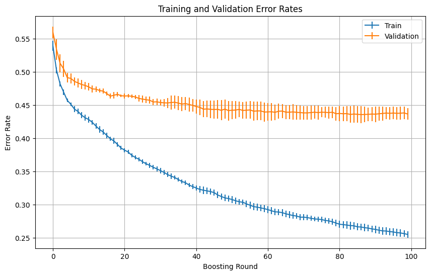

# Emotion Detection in Persian Text: A Classical Machine-Learning Baseline

## Overview

This project implements a **classical machine-learning pipeline** to detect five basic emotions in Persian (Farsi) social media text: `HAPPY`, `SAD`, `ANGRY`, `FEAR`, and `OTHER`. The goal is to establish a **transparent and reproducible baseline** using non-neural models like Logistic Regression and XGBoost.

While deep learning models dominate emotion detection in resource-rich languages, this work focuses on **low-resource settings**, where computation and labeled data are limited.

## Dataset

- ~4,200 manually labeled Persian sentences
- Each text labeled with exactly one emotion
- Data split:
  - 80% Training
  - 20% Test (internal)

## Preprocessing

- Unicode normalization
- Removal of URLs, punctuation, digits, etc.
- Tokenization via [Hazm](https://github.com/sobhe/hazm)
- Stop-word filtering (2–4 grams)
- Rejoined tokens for vectorization

## Exploratory Data Analysis (EDA)

### Word Frequency (`freq > 100`)


- Common words are mostly neutral and non-discriminative
- Highlights need for bigram features and stop-word removal

### Class Distribution


- `HAPPY` and `OTHER` dominate (~60% total)
- `FEAR` is severely underrepresented (<6%)
- Imbalance motivates macro-averaged metrics

## Modeling Approach

### 1. Logistic Regression (Baseline)
- TF–IDF vectorization
- L2 regularization
- Grid search on C ∈ {0.01, 0.1, 1, 10}
- Best C: 1

### 2. XGBoost (Ensemble Model)
- Non-linear model using the same TF–IDF features
- Key parameters:
  - `max_depth`: 6
  - `learning_rate`: 0.1
  - `n_estimators`: 100
  - `subsample`: 0.8
  - `colsample_bytree`: 0.8
- Early stopping at round 67

### Learning Curves


- Boosting shows clear improvement over time
- Slight overfitting after round 70+

## Results

| Model              | Precision | Recall | F1-score |
|-------------------|-----------|--------|----------|
| Logistic Regression | 0.20      | 0.21   | 0.11     |
| XGBoost             | 0.42      | 0.38   | 0.37     |

- Boosting improves F1-score **by over 3×**
- FEAR class remains challenging due to low support

## Key Takeaways

- **XGBoost outperforms** the linear model by learning non-linear feature interactions
- Imbalance and feature sparsity are key limitations
- Classical pipelines are still informative, especially for:
  - Resource-constrained environments
  - Educational benchmarks

## Software Environment

- Python 3.11.4
- scikit-learn 1.5
- XGBoost 2.0
- Hazm 0.9.0

## Structure

```
├── data/                  # Contains labeled Persian text
├── preprocessing/         # Cleaning, tokenization, stopword removal
├── models/                # Logistic regression and XGBoost training scripts
├── visualizations/        # EDA and performance plots
├── report.pdf             # Final project report
├── output.png             # Word frequency plot
├── output2.png            # Class distribution
├── output3.png            # Error curves
├── README.md              # This file
```

## Future Improvements

1. Fine-tune multilingual transformers (e.g., XLM-R, mBERT)
2. Embed emojis or convert them to textual emotions
3. Curriculum learning: binary → multi-class
4. Address imbalance using SMOTE or weighted loss

## Citation

> Mahla Entezari, Shahid Beheshti University (June 2024)  
> *Emotion Detection in Persian Text: A Classical Machine-Learning Baseline*

---
